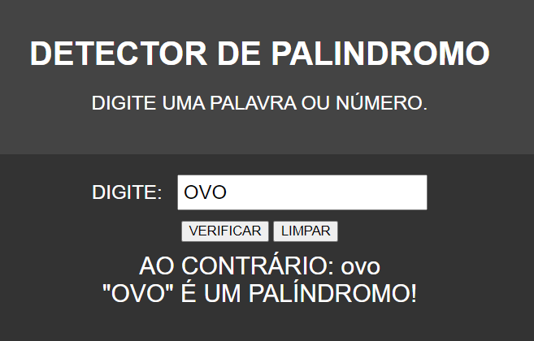

# DETECTOR DE PALINDROMO
🆎DETECTOR DE PALINDROMO EM HTML, CSS E JS.

  

## DESCRIÇÃO:
Este projeto consiste em um detector de palíndromos, ou seja, ele verifica se uma palavra ou número digitado pelo usuário é igual quando lido de trás para frente. Aqui estão as principais funcionalidades implementadas:

1. Entrada de Texto ou Número:
   - Permite ao usuário digitar uma palavra ou número no campo de entrada.

2. Verificação de Palíndromo:
   - Ao clicar no botão "VERIFICAR", o programa verifica se a entrada é um palíndromo.
   - O resultado da verificação é exibido abaixo do campo de entrada.

3. Limpar:
   - Ao clicar no botão "LIMPAR", o campo de entrada é limpo, e qualquer resultado anterior é removido da tela.

## EXECUTANDO O PROJETO:
1. Digitar Palavra ou Número:
   - Insira a palavra ou número que deseja verificar no campo de entrada.

2. Verificar Palíndromo:
   - Clique no botão "VERIFICAR" para verificar se a entrada é um palíndromo.
   - O resultado será exibido logo abaixo do campo de entrada.

3. Limpar Campo:
   - Se desejar limpar o campo de entrada e o resultado da verificação, clique no botão "LIMPAR".
   - Isso removerá qualquer entrada anterior e resultado da tela.
   
## NÃO SABE?
- Entendemos que para manipular arquivos em `HTML`, `CSS` e outras linguagens relacionadas, é necessário possuir conhecimento nessas áreas. Para auxiliar nesse aprendizado, oferecemos cursos gratuitos disponíveis:
* [CURSO DE HTML E CSS](https://github.com/VILHALVA/CURSO-DE-HTML-E-CSS)
* [CURSO DE JAVASCRIPT](https://github.com/VILHALVA/CURSO-DE-JAVASCRIPT)
* [CONFIRA MAIS CURSOS](https://github.com/VILHALVA?tab=repositories&q=+topic:CURSO)

## CREDITOS:
- [PROJETO CRIADO PELO VILHALVA](https://github.com/VILHALVA)

